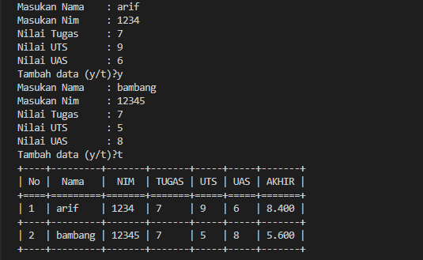

> - [Flowchart](#flowchart)
> - [Latihan Membuat list & perulangan nilai akhir mahasiswa](#latihan-membuat-list--perulangan-nilai-akhir-mahasiswa)
> - [Output Program](#output-program)
### Flowchart

### Latihan Membuat list & perulangan nilai akhir mahasiswa
    # menggunakan modul Texttable
    from texttable import Texttable
    table = Texttable()
    # variable menggunakan list
    no = 0
    nama = []
    nim = []
    nilai_tugas = []
    nilai_uts = []
    nilai_uas = []

    # Buat sebuah perulangan, tujuannya karena kita ingin memasukkan beberapa data sekaligus.
    # Disini saya pakai while, dan di dalam perulangan inilah kita masukkan perintah untuk Input data yang kita butuhkan.
    # Dengan menggunakan syntax “variabel.append”, saya bertujuan untuk memasukkan data pada variabel-variabel List yang sudah saya buat tadi.
    # penginputan data oleh user
    jawab = "y"
    while (jawab == "y"):
        nama.append(input("Masukan Nama\t: "))
        nim.append(input("Masukan Nim\t: "))
        nilai_tugas.append(input("Nilai Tugas\t: "))
        nilai_uts.append(input("Nilai UTS\t: "))
        nilai_uas.append(input("Nilai UAS\t: "))
        jawab = input("Tambah data (y/t)?")
        no += 1

    # Disini saya menggunakan for dan saya buat lagi variabel-variabel lokal yang dipakai hanya buat perhitungan doang.
    # Karena ada satu bagian di dalam tabel yaitu NILAI AHIR yang merupakan perhitungan dari 30% TUGAS, 35% UTS, dan 35% UAS.
    # Dan disini juga kita konversi nilai variabel yang tadinya string menjadi float, supaya bisa dihitung.
    # perhitungan
    for i in range(no):
        tugas = float(nilai_tugas[i])
        uts = float(nilai_uts[i])
        uas = float(nilai_uts[i])
        akhir = (tugas*30/100)+(uts*35/100)+(uas*35/100)

    # Dan setelah itu kita gunakan table-nya disini. Dengan syntax table.add_rows,
    # kita masukkan Tabel apa saja yang akan kita buat, beserta variabelnya.
    # Perhatikan urutannya jangan sampai tertukar.
    # Disini saya buat tabel dengan header No, Nama, NIM, Tugas, UTS, UAS, dan Nilai Akhir yang tadi sempet saya bilang pakai perhitungan (Tidak Diinput)
    table.add_rows([['No', 'Nama', 'NIM', 'TUGAS', 'UTS', 'UAS', 'AKHIR'], [
        i+1, nama[i], nim[i], nilai_tugas[i], nilai_uts[i], nilai_uas[i], akhir]])

    # Dan pada bagian terahir dari script ini kita masukkan perintah untuk mencetak hasilnya yaitu
    print(table.draw())

### Output Program
